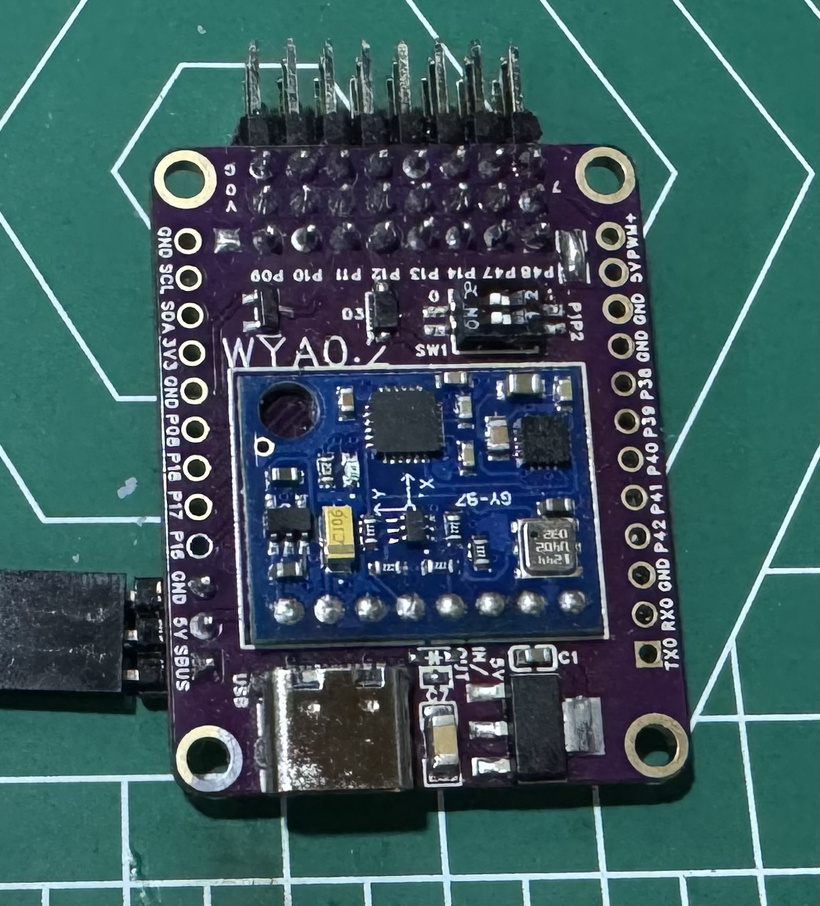
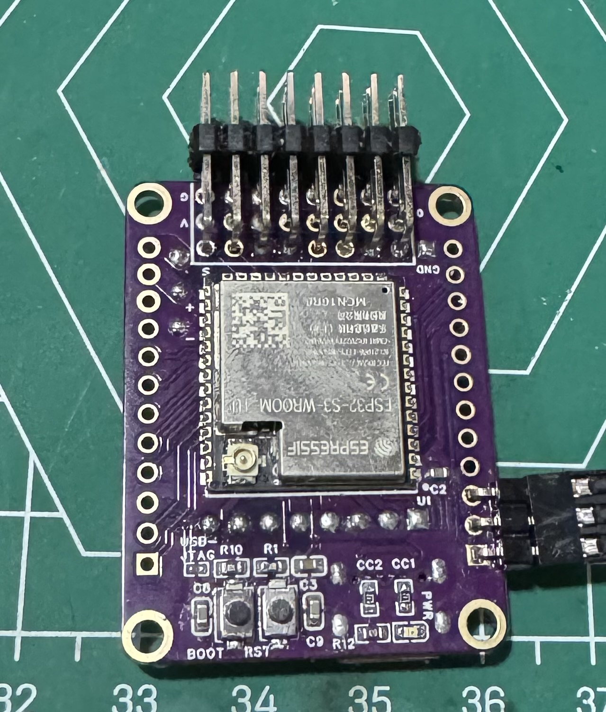

# AP210
## SPI_FLASH_FILE_SYSTEM
QIO 80Hz(==freq(psram)) 16MB
...
## mode
sw2 | sw1 | boot_mode | \ |
--- | --- | ---- | --- |
 0  |  0  | flight | \ |
 0  |  1  | flash_msc | close_log_file |
 1  |  0  | dscard_msc | close_log_file |
 1  |  1  | reset | \ |

## Image
<left class="half">

</left>
